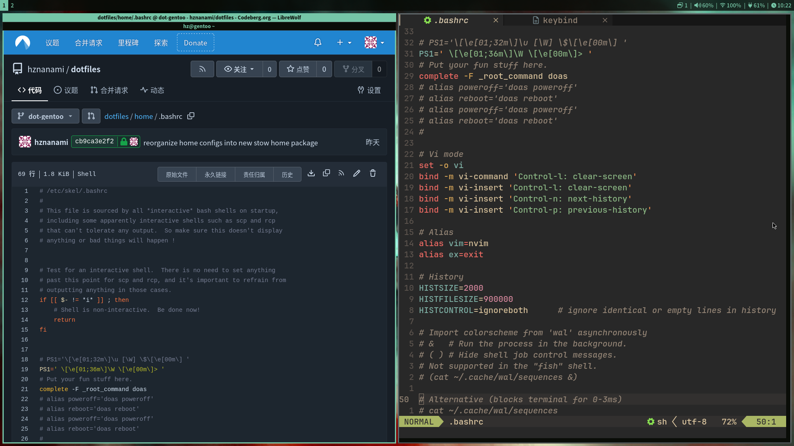
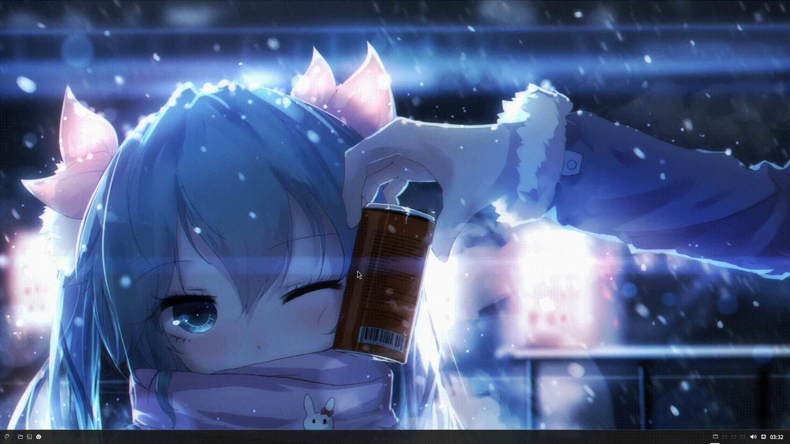

# dotfiles

[English](README.md) - [繁體中文 (zh-TW)](README-zh-TW.md)

我的Debian 13桌面环境配置文件。


<br>

## 使用方法

> [!NOTE]
> 本分支仅包含**Debian 13+labwc**的配置。如果你只想使用Debian版本的dotfiles，建议直接克隆`dot-debian`分支。

### 仅克隆Debian分支

从Codeberg克隆

```sh
git clone --branch dot-debian --single-branch --recurse-submodules https://codeberg.org/hznanami/dotfiles.git
```

或从GitHub克隆

```sh
git clone --branch dot-debian --single-branch --recurse-submodules https://github.com/hznanami/dotfiles.git
```

如果不需要子模块，可以移除`--recurse-submodules`：

```sh
git clone --branch dot-debian --single-branch https://codeberg.org/hznanami/dotfiles.git
```

或：

```sh
git clone --branch dot-debian --single-branch https://github.com/hznanami/dotfiles.git
```

### 如果已经克隆完整仓库

如果你已经克隆了完整仓库，之后想切换到Debian分支：

```sh
git switch dot-debian
```

或：

```sh
git checkout dot-debian
```

### 应用配置

本仓库中的配置文件可以通过以下方式使用：

1. 创建符号链接到主目录
2. 使用GNU Stow管理
3. 手动复制到对应位置

### 手动安装

部分字体和二进制程序不在Debian 13软件仓库中，需要手动下载并安装。

详情请参阅：

`docs/manual-installation.md`

<br>

## 使用的软件

| 组件 | 软件 |
|------|------|
| 窗口管理器 | [labwc-0.8.4](https://github.com/labwc/labwc) |
| Shell | [bash](https://www.gnu.org/software/bash/bash.html) |
| 终端 | [foot](https://codeberg.org/dnkl/foot) |
| 面板 | [waybar](https://github.com/Alexays/Waybar) |
| 壁纸工具 | [swaybg](https://github.com/swaywm/swaybg) |
| 编辑器 | [neovim](https://github.com/neovim/neovim) |
| 文件管理器 | [lf](https://github.com/gokcehan/lf) |
| 浏览器 | [ungoogled-chromium](https://github.com/ungoogled-software/ungoogled-chromium) |
| 启动器 | [fuzzel](https://codeberg.org/dnkl/fuzzel) |
| 模糊查找 | [fzf](https://github.com/junegunn/fzf) |
| 通知 | [mako](https://github.com/emersion/mako) |
| 锁屏 | [swaylock](https://github.com/swaywm/swaylock) |
| 视频播放器 | [mpv](https://github.com/mpv-player/mpv) |
| 图片查看器 | [swayimg](https://github.com/artemsen/swayimg) |
| 屏幕录制 | [wf-recorder](https://github.com/ammen99/wf-recorder) |
| 权限提升工具 | [doas](https://github.com/Duncaen/OpenDoas) |
| Dotfiles管理器 | [stow](https://github.com/aspiers/stow) 与 [git](https://github.com/git/git) |

### 关于waybar


需要用到的软件包为：`waybar`、`fuzzel`，其中waybar版本要`0.14.0`以上，如果你的waybar版本低于此版本，
则不支持此配置的`ext/workspaces`，也就无法通过点击工作区按钮来切换工作区。
该waybar配置的右下角为快速显示桌面，此功能需要用到`wlrctl`

> [!NOTE]
> 以下操作需要root权限

Debian（最小化安装）:

```sh
apt install --no-install-recommends wlrctl
```

ArchLinux（或衍生版本）：

需要用到AUR，以paru为例
```sh
paru -S wlrctl
```

Gentoo用户需要自己手动拉取源码编译，因为overlays没有包

另外可以自定义修改waybar配置来符合你的需求，比如fuzzel可以更换你喜爱的启动器、更换快捷启动的程序、更改图标等等。


### 关于壁纸切换


需要用到的文件：源码`home/.config/labwc/scripts/wpick.py`、快捷启动脚本`home/.local/bin/wpick`、
desktop文件（可选）`home/.local/share/applications/wpick.desktop`、图标文件（可选）`home/.local/share/icons/*`

另外该程序只支持swaybg

该程序需要安装以下额外依赖：`pygobject`、`gtk3`、`swaybg`、`python3`（大部分已作为依赖安装，正常情况可以不用管）

步骤一：

> [!NOTE]
> 以下操作需要root权限

Debian（最小化安装）:

```sh
apt install --no-install-recommends python3-gi gir1.2-gtk-3.0 swaybg python3-minimal
```

ArchLinux（或衍生版本）：

```sh
pacman -S --needed python-gobject gtk3 swaybg python
```

Gentoo （python作为portage的必要依赖，不需要重新安装）：
```sh
emerge --ask --verbose dev-python/pygobject x11-libs/gtk+ gui-apps/swaybg
```

步骤二：

设定labwc的autostart为：

```sh
swaybg -i "$HOME/.cache/labwc/wallpaper/current" -m fill >/dev/null 2>&1 &
```

其中`current`为软链接文件，由壁纸切换程序根据选择的壁纸进行链接；而壁纸切换程序中设定swaybg的背景模式为`fill`（填充），并和autostart保持一致，如果需要更改，请自行修改wpick.py和autostart
<br>

## 使用到的项目

[gnuunixchad](https://github.com/gnuunixchad/dotfiles) - 参考并使用了部分配置和脚本，并进行了自定义修改

