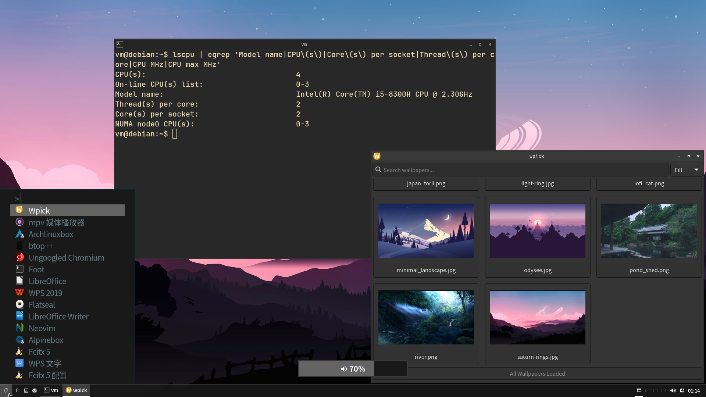
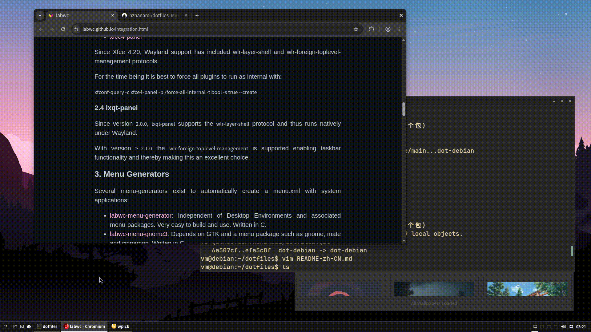
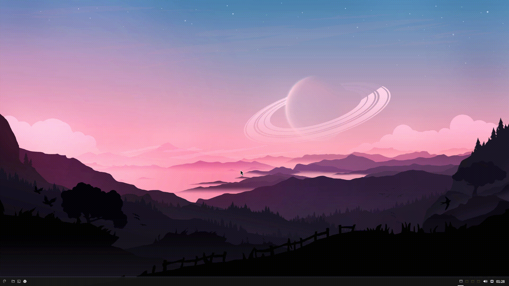

# dotfiles

[English](README.md) - [简体中文 (zh-CN)](README-zh-CN.md)

我的Debian 13桌面環境設定檔。


<br>

## 使用方式

> [!NOTE]
> 此分支僅包含**Debian 13 + labwc**的設定。如果你只想使用Debian版本的dotfiles，建議直接複製`dot-debian`分支。

### 僅複製Debian分支

從Codeberg複製

```sh
git clone --branch dot-debian --single-branch --recurse-submodules https://codeberg.org/hznanami/dotfiles.git
```

或從GitHub複製

```sh
git clone --branch dot-debian --single-branch --recurse-submodules https://github.com/hznanami/dotfiles.git
```

如果不需要子模組，可以移除 `--recurse-submodules`：

```sh
git clone --branch dot-debian --single-branch https://codeberg.org/hznanami/dotfiles.git
```

或：

```sh
git clone --branch dot-debian --single-branch https://github.com/hznanami/dotfiles.git
```

### 如果已經複製完整儲存庫

如果你已經複製了完整的儲存庫，之後想切換到Debian分支：

```sh
git switch dot-debian
```

或：

```sh
git checkout dot-debian
```

### 套用設定

此儲存庫中的設定檔可以透過以下方式使用：

1. 建立符號連結到你的家目錄
2. 使用GNU Stow管理
3. 手動複製到對應位置

### 手動安裝

有些字型與二進位檔不在Debian13的套件庫中，需要手動下載與安裝。

請參考：

`docs/manual-installation.md`

<br>

## 使用的軟體

| 元件 | 軟體 |
|------|------|
| 視窗管理器 | [labwc-0.8.4](https://github.com/labwc/labwc) |
| Shell | [bash](https://www.gnu.org/software/bash/bash.html) |
| 終端機 | [foot](https://codeberg.org/dnkl/foot) |
| 面板 | [waybar](https://github.com/Alexays/Waybar) |
| 桌布工具 | [swaybg](https://github.com/swaywm/swaybg) |
| 編輯器 | [neovim](https://github.com/neovim/neovim) |
| 檔案管理器 | [lf](https://github.com/gokcehan/lf) |
| 瀏覽器 | [ungoogled-chromium](https://github.com/ungoogled-software/ungoogled-chromium) |
| 啟動器 | [fuzzel](https://codeberg.org/dnkl/fuzzel) |
| 模糊搜尋 | [fzf](https://github.com/junegunn/fzf) |
| 通知 | [mako](https://github.com/emersion/mako) |
| 鎖定畫面 | [swaylock](https://github.com/swaywm/swaylock) |
| 影片播放器 | [mpv](https://github.com/mpv-player/mpv) |
| 圖片檢視器 | [swayimg](https://github.com/artemsen/swayimg) |
| 螢幕錄製 | [wf-recorder](https://github.com/ammen99/wf-recorder) |
| 權限提升工具 | [doas](https://github.com/Duncaen/OpenDoas) |
| Dotfiles 管理器 | [stow](https://github.com/aspiers/stow) 與 [git](https://github.com/git/git) |

### 關於waybar


需要使用的套件為`waybar`、`fuzzel`，其中waybar版本需要為`0.14.0`以上。如果你的waybar版本低於此版本，
則不支援此設定中的`ext/workspaces`，也就無法透過點擊工作區按鈕來切換工作區。

這個waybar設定的右下角是用來快速顯示桌面的功能，這個功能需要用到`wlrctl`。

> [!NOTE]
> 以下操作需要root權限。

Debian（最小化安裝）：

```sh
apt install --no-install-recommends wlrctl
```

ArchLinux（或衍生版本）：

需要用到AUR，以`paru`為例：

```sh
paru -S wlrctl
```

Gentoo使用者需要自己手動拉取原始碼編譯，因為overlays沒有套件。

另外也可以自訂修改waybar設定來符合你的需求，比如`fuzzel`可以更換成你喜歡的啟動器、更換快捷啟動的程式、更改圖示等等。

### 關於桌布切換


需要使用的檔案：原始碼 `home/.config/labwc/scripts/wpick.py`、快捷啟動腳本 `home/.local/bin/wpick`、
桌面檔案（可選）`home/.local/share/applications/wpick.desktop`、圖示檔案（可選）`home/.local/share/icons/*`

另外，此程式預設識別的桌布路徑為`$HOME/Pictures/wallpaper`（可以自行修改`wpick.py`來更改路徑），且此程式只支援`swaybg`

此程式需要安裝以下額外相依套件：`pygobject`、`gtk3`、`swaybg`、`python3`（大部分已作為相依套件安裝，正常情況下可以不用管）

步驟一：

> [!NOTE]
> 以下操作需要root權限。

Debian（最小化安裝）：

```sh
apt install --no-install-recommends python3-gi gir1.2-gtk-3.0 swaybg python3-minimal
```

ArchLinux（或衍生版本）：

```sh
pacman -S --needed python-gobject gtk3 swaybg python
```

Gentoo（`python`是portage的必要相依套件，不需要重新安裝）：

```sh
emerge --ask --verbose dev-python/pygobject x11-libs/gtk+ gui-apps/swaybg
```

步驟二：

將labwc的autostart設定為：

```sh
# Set wallpaper with wpick.
MODE_FILE="$HOME/.cache/labwc/wallpaper/mode"
if [ ! -f "$MODE_FILE" ]; then
   echo fill > "$MODE_FILE"
fi
MODE=$(cat "$MODE_FILE")
swaybg -i "$HOME/.cache/labwc/wallpaper/current" -m "$MODE" >/dev/null 2>&1 &
```

其中`current`為符號連結，由桌布切換程式根據所選擇的桌布建立及更新；當`mode`檔案不存在時，會建立一個預設值為**fill**的檔案。該檔案中的值可以由桌布程式在手動切換背景模式時進行更改

步驟三：

將原始碼檔案`wpick.py`、快捷啟動腳本`wpick`、desktop檔案`wpick.desktop`（選用）、圖示檔案（選用）放到指定位置：

你可以使用stow工具來管理這些檔案，或者也可以使用以下命令
切換到克隆下來的目錄
```sh
cd dotfiles
```

複製wpick.py，注意這一步需要確認PATH是否包含".local/bin"，如果沒有，請自行加上，或者改用其他路徑
```sh
mkdir -p ~/.config/labwc/scripts
cp home/.config/labwc/scripts/wpick.py ~/.config/labwc/scripts
```

複製啟動腳本wpick
```sh
mkdir -p ~/.local/bin
cp home/.local/bin/wpick ~/.local/bin
```

複製desktop檔案（選用）
```sh
mkdir -p ~/.local/share/applications
cp home/.local/share/applications/wpick.desktop ~/.local/share/applications
```

複製圖示檔案（選用）
```sh
cp -r home/.local/share/icons ~/.local/share
```

完成以上步驟後，就可以在launcher或命令列啟動wpick程式
<br>

## 使用到的項目

[gnuunixchad](https://github.com/gnuunixchad/dotfiles) - 參考並使用了部分配置和腳本，並進行了自訂修改

