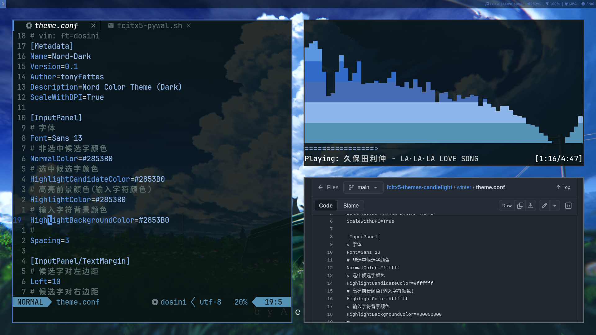

# dotfiles





<br>

## 使用方法

> [!Note]
> - 由於該倉庫包含[mpv-file-browser](https://github.com/CogentRedTester/mpv-file-browser)第三方項目，如果需要複製包含該項目請加入`--recurse-submodules`參數
> - 如果不需要該mpv插件項目，直接git clone即可

### 在codeberg上複製此版本庫

```
git clone --recurse-submodules https://codeberg.org/hznanami/dotfiles.git
```

### 或者在github上 

```
git clone --recurse-submodules https://github.com/hznanami/dotfiles.git
```

### 應用該配置

該資源庫中的設定檔可以是：

1. 連結到您的主目錄
2. 使用點檔案管理器（如 GNU [Stow](https://github.com/aspiers/stow)）進行管理
3. 手動複製到適當位置

<br>

## 程序

我使用的程序和工具列表

| 組件              | 程序       |
|-------------------|------------|
| 窗口管理器        | [sway](https://github.com/swaywm/sway)    |
| Shell             | [bash](https://www.gnu.org/software/bash/bash.html)    |
| 終端              | [foot](https://codeberg.org/dnkl/foot)    |
| Bar               | swaybar    |
| Bar狀態           | [i3blocks](https://github.com/vivien/i3blocks)    |
| 壁紙工具          | [swaybg](https://github.com/swaywm/swaybg)    |
| 編輯器            | [neovim](https://github.com/neovim/neovim)    |
| 檔案管理器        | [yazi](https://github.com/sxyazi/yazi)    |
| 瀏覽器            | [librewolf](https://codeberg.org/librewolf/source)    |
| 啟動器            | [wmenu](https://codeberg.org/adnano/wmenu)    |
| 模糊尋找器        | [fzf](https://github.com/junegunn/fzf)    |
| 通知              | [mako](https://github.com/emersion/mako)    |
| 鎖定螢幕          | [swaylock](https://github.com/swaywm/swaylock)    |
| 音樂播放器守護進程| [mpd](https://github.com/MusicPlayerDaemon/MPD)    |
| MPD用戶端         | [ncmpcpp](https://github.com/ncmpcpp/ncmpcpp)    |
| 影片播放器        | [mpv](https://github.com/mpv-player/mpv)    |
| 圖片查看器        | [swayimg](https://github.com/artemsen/swayimg)    |
| 螢幕錄製          | [wf-recorder](https://github.com/ammen99/wf-recorder)    |
| 主題配色          | [pywal16](https://github.com/eylles/pywal16)    |
| BitTorrent用戶端  | [rtorrent](https://github.com/rakshasa/rtorrent)    |
| 沙盒工具          | [bubblewrap](https://github.com/containers/bubblewrap)    |
| 提權工具          | [doas](https://github.com/Duncaen/OpenDoas)    |
| Dotfiles管理      | [stow](https://github.com/aspiers/stow) & [git](https://github.com/git/git)    |
| 初始化系統        | [openrc](https://github.com/OpenRC/openrc)    |

<br>

### 對於bubblewrap

本倉庫的`librewolf`、`Heroic Games Launcher` 使用bubblwrap工具進行沙盒化，並配置到用戶path環境替換默認啟動命令路徑，它們都運行在無特權的沙盒容器環境中，主要目的是隔離`/home`目錄

<br>

## 截圖中使用到的壁紙  
截圖一：
- <https://www.pixiv.net/artworks/98623904>
 
截圖二：
- <https://www.pixiv.net/artworks/47305056>
 
截圖三：
- <https://www.pixiv.net/artworks/117800137>
 
截圖四：
- <https://www.pixiv.net/artworks/112924536>

<br>

## 特別感謝

[gununixchad](https://github.com/gnuunixchad/dotfiles) - 參考並使用了部分配置和腳本，並進行了自訂修改

[BreadOnPenguins](https://github.com/BreadOnPenguins/scripts) - 參考並使用了部分腳本，並作了修改


