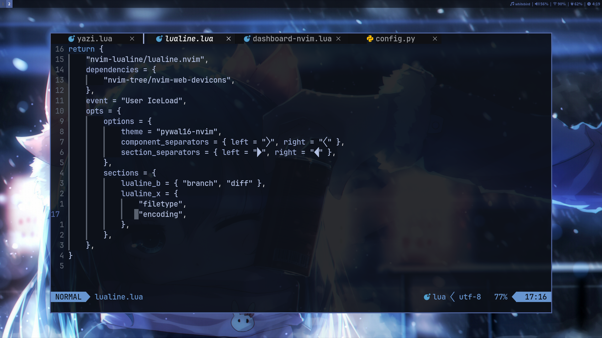

# dotfiles




<br>

## 使用方法

### 在codeberg上複製此版本庫

```
git clone https://codeberg.org/hznanami/dotfiles.git
```

### 或者在github上 

```
git clone https://github.com/hznanami/dotfiles.git
```

<br>

## 程序

我使用的程序和工具列表

| 組件              | 程序       |
|-------------------|------------|
| 窗口管理器        | [sway](https://github.com/swaywm/sway)    |
| Shell             | [bash](https://www.gnu.org/software/bash/bash.html)    |
| 終端              | [foot](https://codeberg.org/dnkl/foot)    |
| Bar               | swaybar    |
| Bar狀態           | [i3blocks](https://github.com/vivien/i3blocks)    |
| 壁紙工具          | [swaybg](https://github.com/swaywm/swaybg)    |
| 編輯器            | [neovim](https://github.com/neovim/neovim)    |
| 檔案管理器        | [yazi](https://github.com/sxyazi/yazi)    |
| 瀏覽器            | [librewolf](https://codeberg.org/librewolf/source) / [qutebrowser](https://github.com/qutebrowser/qutebrowser)    |
| 啟動器            | [wmenu](https://codeberg.org/adnano/wmenu)    |
| 模糊尋找器        | [fzf](https://github.com/junegunn/fzf)    |
| 通知              | [mako](https://github.com/emersion/mako)    |
| 鎖定螢幕          | [swaylock](https://github.com/swaywm/swaylock)    |
| 音樂播放器        | [mpd](https://github.com/MusicPlayerDaemon/MPD) / [ncmpcpp](https://github.com/ncmpcpp/ncmpcpp)    |
| 影片播放器        | [mpv](https://github.com/mpv-player/mpv)    |
| 圖片查看器        | [swayimg](https://github.com/artemsen/swayimg)    |
| 螢幕錄製          | [wf-recorder](https://github.com/ammen99/wf-recorder)    |
| 主題配色          | [pywal16](https://github.com/eylles/pywal16)    |
| BitTorrent用戶端  | [rtorrent](https://github.com/rakshasa/rtorrent)    |
| 提權工具          | [doas](https://github.com/Duncaen/OpenDoas)    |
| 初始化系統        | [openrc](https://github.com/OpenRC/openrc)    |

<br>

## 截圖中使用到的壁紙  

<https://www.pixiv.net/artworks/98623904>

<https://www.pixiv.net/artworks/47305056>

<https://www.pixiv.net/artworks/117800137>

<https://www.pixiv.net/artworks/112924536>


<br>

## 特別感謝

[gununixchad](https://github.com/gnuunixchad/dotfiles) - 參考並使用了部分配置和腳本，並進行了自訂修改

[BreadOnPenguins](https://github.com/BreadOnPenguins/scripts) - 參考並使用了部分腳本，並作了修改


