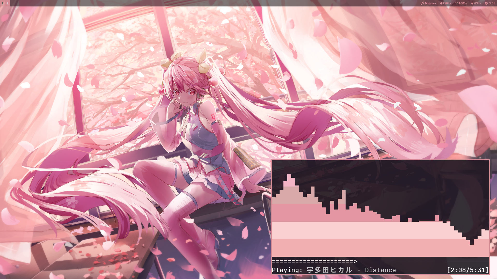
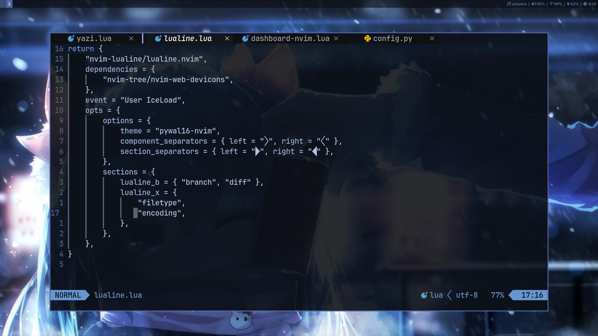
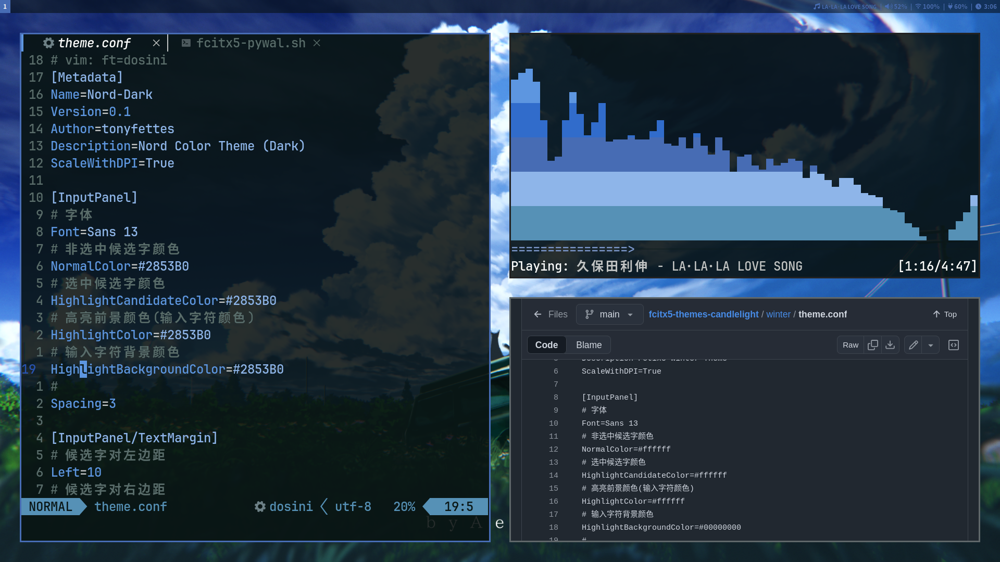
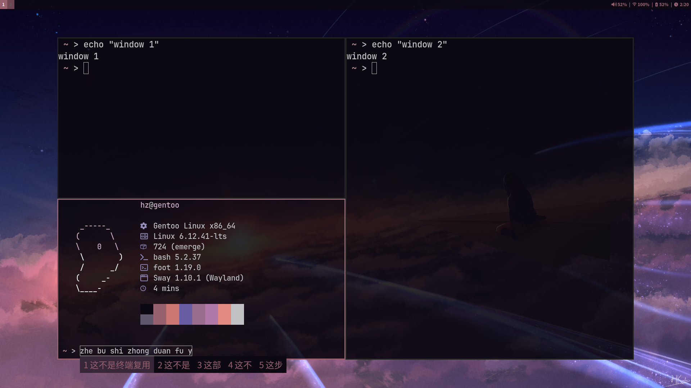

# dotfiles

[中文-简体](README-zh-CN.md) - [中文-繁體(臺灣)](README-zh-TW.md)






<br>

## Usage

> [!Note] 
> - Since this repository contains the [mpv-file-browser](https://github.com/CogentRedTester/mpv-file-browser) third-party project, if you need to clone it, please add the `--recurse-submodules` parameter. 
> - If you don't need the mpv plugin project, just git clone it.

### Clone this repository on codeberg

```
git clone --recurse-submodules https://codeberg.org/hznanami/dotfiles.git
```

### Or on github

```
git clone --recurse-submodules https://github.com/hznanami/dotfiles.git
```

### Applying Configuration

The configuration files in this repository can be:

1. Symlinked to your home directory
2. Managed with a dotfiles manager like GNU [Stow](https://github.com/aspiers/stow)
3. Manually copied to the appropriate locations

<br>

## Programs

List of programs and tools I use

| Component                | Program    |
|--------------------------|------------|
| Winodws Manager          | [sway](https://github.com/swaywm/sway)    |
| Shell                    | [bash](https://www.gnu.org/software/bash/bash.html)    |
| Terminal                 | [foot](https://codeberg.org/dnkl/foot)    |
| Bar                      | swaybar    |
| Status bar               | [i3blocks](https://github.com/vivien/i3blocks)    |
| Wallpaper utility        | [swaybg](https://github.com/swaywm/swaybg)    |
| Editor                   | [neovim](https://github.com/neovim/neovim)    |
| File Manager             | [yazi](https://github.com/sxyazi/yazi)    |
| Browser                  | [librewolf](https://codeberg.org/librewolf/source)    |
| Launcher                 | [wmenu](https://codeberg.org/adnano/wmenu)    |
| Fuzzy Finder             | [fzf](https://github.com/junegunn/fzf)    |
| Notification             | [mako](https://github.com/emersion/mako)    |
| Lockscreen               | [swaylock](https://github.com/swaywm/swaylock)    |
| Music player             | [mpd](https://github.com/MusicPlayerDaemon/MPD) & [ncmpcpp](https://github.com/ncmpcpp/ncmpcpp)    |
| Video player             | [mpv](https://github.com/mpv-player/mpv)    |
| Image Viewer             | [swayimg](https://github.com/artemsen/swayimg)    |
| Screen recording         | [wf-recorder](https://github.com/ammen99/wf-recorder)    |
| Color Theme              | [pywal16](https://github.com/eylles/pywal16)    |
| BitTorrent client        | [rtorrent](https://github.com/rakshasa/rtorrent)    |
| Privilege escalation tool| [doas](https://github.com/Duncaen/OpenDoas)    |
| Dotfiles Manager         | [stow](https://github.com/aspiers/stow) & [git](https://github.com/git/git)    |
| Init system              | [openrc](https://github.com/OpenRC/openrc)    |

<br>

## Wallpapers used in screenshots 

<https://www.pixiv.net/artworks/98623904>

<https://www.pixiv.net/artworks/47305056>

<https://www.pixiv.net/artworks/117800137>

<https://www.pixiv.net/artworks/112924536>


<br>

## Special Thanks

[gununixchad](https://github.com/gnuunixchad/dotfiles) - Referenced and used a portion of the configuration and scripts with custom modifications

[BreadOnPenguins](https://github.com/BreadOnPenguins/scripts) - A portion of the script was referenced and used with modifications
